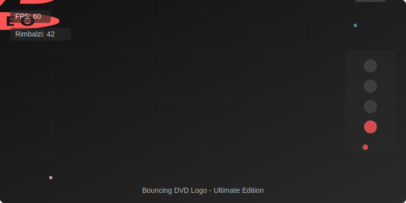

# 💿 Bouncing DVD Logo - Ultimate Edition

Una ricreazione avanzata dell'animazione classica del logo DVD che rimbalza, migliorata con effetti moderni e molte nuove funzionalità.

## Demo

## Installazione e Avvio

### Opzione 1: Esecuzione Locale
1. Clona questo repository: `git clone https://github.com/tuonome/bouncingdvdlogo.git`
2. Naviga nella directory del progetto: `cd bouncingdvdlogo`
3. Apri il file `index.html` nel tuo browser preferito

### Opzione 2: Utilizzo Diretto
1. Scarica i file del progetto (ZIP)
2. Estrai il contenuto in una cartella
3. Apri il file `index.html` nel tuo browser

### Opzione 3: Demo Online
Puoi provare la demo online [qui](https://example.com/bouncingdvdlogo) (link dimostrativo)

### Compatibilità
- Funziona su tutti i browser moderni: Chrome, Firefox, Safari, Edge
- Supporto completo per dispositivi mobili e tablet
- Requisiti minimi: Browser con supporto HTML5 e JavaScript

## Caratteristiche

### Funzionalità Base
- 🎯 Logo DVD che rimbalza con fisica realistica
- 🌈 Cambi di colore fluidi ad ogni collisione
- 🎮 Controlli direzionali con tastiera e touch
- ⏯️ Pausa/ripresa con barra spaziatrice o pulsante
- 🔄 Rilevamento dei "perfect hit" (angoli) con effetti speciali

### Funzionalità Avanzate
- 🚶‍♂️ Modalità "Scia" con effetto trail
- 👯‍♂️ Modalità "Multi" con più loghi contemporaneamente
- 🌍 Modalità "Gravità" con fisica avanzata
- 📏 Controllo dimensioni del logo
- 🏎️ Controllo velocità dell'animazione
- 📊 Contatore FPS in tempo reale
- 📈 Statistiche sui rimbalzi e sui perfect hit
- 📱 Supporto completo per dispositivi mobili con controlli touch

### Nuove Funzionalità
- 🌓 Tema chiaro/scuro con cambio dinamico
- 💾 Salvataggio automatico delle preferenze
- 🔔 Notifiche toast per il feedback utente
- 🎚️ Interfaccia utente migliorata con pannello di controllo slide-in
- 🔧 Completa personalizzazione dell'esperienza

## Come Utilizzare

1. Apri il file `index.html` in un browser web
2. Usa i controlli nel pannello laterale per personalizzare l'esperienza
3. Usa i tasti freccia per controllare la direzione
4. Usa i tasti di scelta rapida:
   - `Spazio`: Pausa/riprendi
   - `R`: Reimposta
   - `T`: Attiva/disattiva scia
   - `M`: Attiva/disattiva modalità multi
   - `G`: Attiva/disattiva gravità
   - `Ctrl+S`: Salva preferenze

## Controlli Touch (Mobile)
1. Scorri orizzontalmente per cambiare direzione orizzontale
2. Scorri verticalmente per cambiare direzione verticale
3. Usa il pannello di controllo per tutte le altre funzioni

## Gestione Preferenze
Le preferenze dell'utente vengono salvate automaticamente nel browser e vengono riapplicate ad ogni visita. È possibile:
- Salvare manualmente le preferenze con il pulsante 💾
- Ripristinare le impostazioni predefinite con il pulsante 🗑️
- Cambiare tema con il pulsante 🌓

## Dettagli Tecnici

### Tecnologie Utilizzate
- HTML5, CSS3, JavaScript (ES6+)
- SVG per la grafica vettoriale
- CSS Animations e Transitions
- CSS Variables per il supporto ai temi
- LocalStorage per il salvataggio delle preferenze
- RequestAnimationFrame per animazioni fluide
- Font Awesome per le icone

### Caratteristiche di Prestazione
- Ottimizzazione con hardware acceleration (transform3d)
- Gestione efficiente della memoria per effetti trail
- Controllo FPS per prestazioni consistenti
- Responsive design per tutti i dispositivi
- Transizioni fluide tra temi

## Sviluppo

### Struttura del Progetto
- `index.html` - Struttura HTML principale
- `styles.css` - Stili CSS, animazioni e temi
- `preferences.js` - Gestione delle preferenze utente
- `script.js` - Logica principale dell'animazione
- `default.svg` - File SVG originale

### Miglioramenti Futuri
- [ ] Personalizzazione completa dei colori
- [ ] Modalità "Collisione" tra loghi multipli
- [ ] Effetti sonori
- [ ] Modalità VR/AR
- [ ] Condivisione configurazioni

## Licenza

MIT License - Vedi il file LICENSE per dettagli